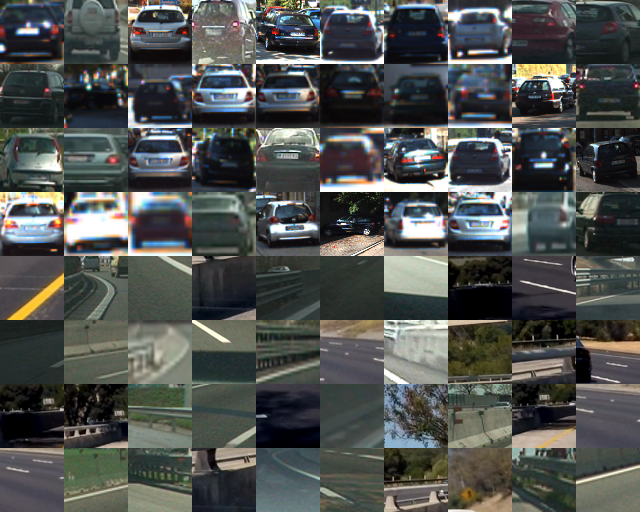
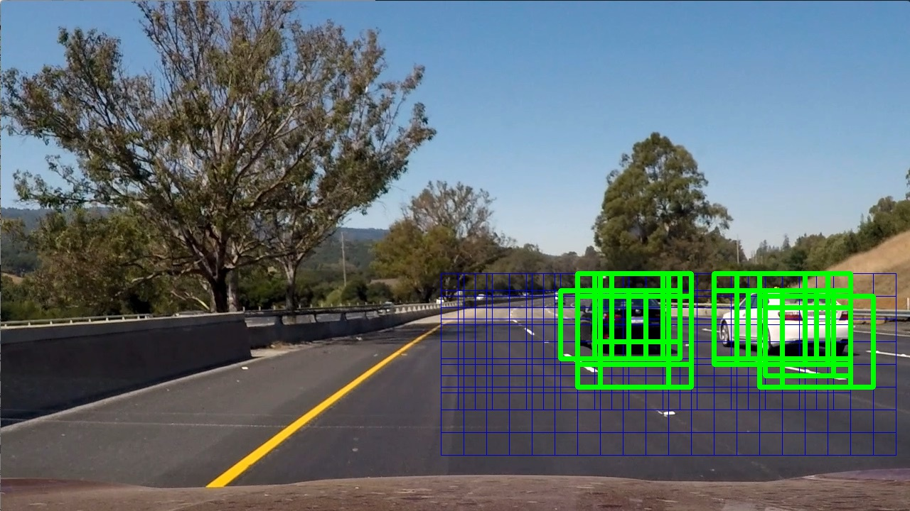
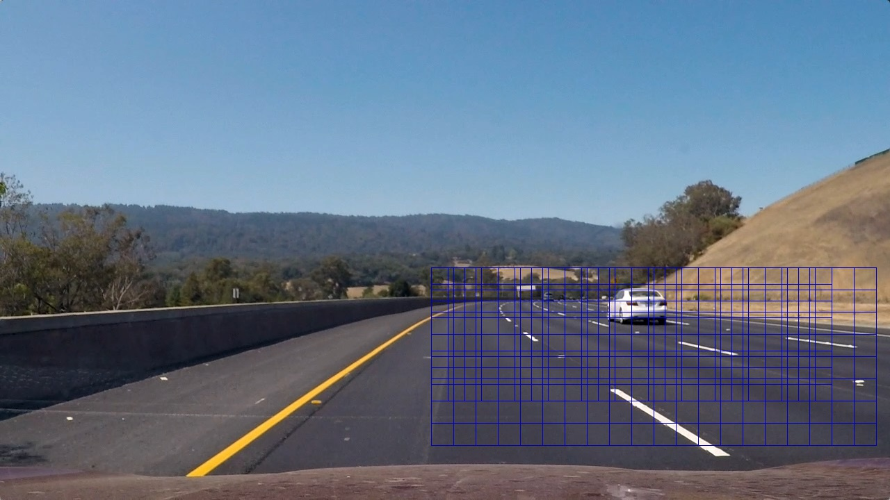
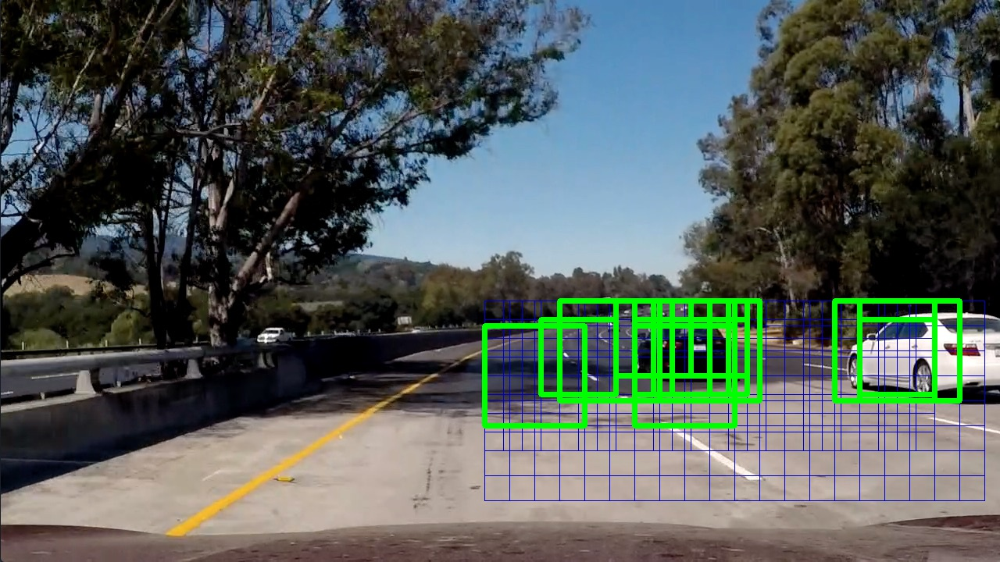
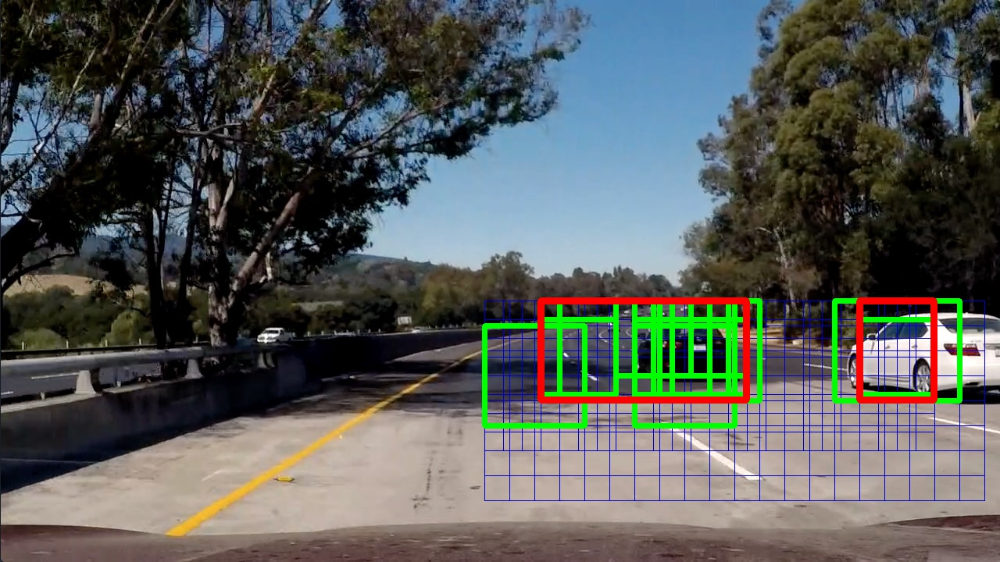
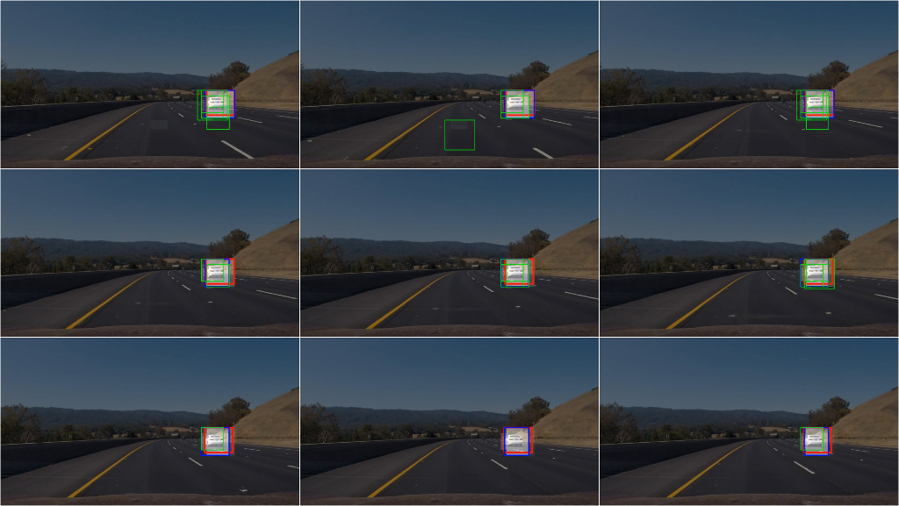

## Vehicle Detection and Tracking

This repository implements vehicle detection and tracking in videos. This is achieved using

- a dataset of vehicle/non-vehicle patches
- a SVM classifier using HOG features
- a multiscale-sliding-window approach to run the classifier on the video frames
- spatial and temporal smoothing to increase the robustness

### Demo

Full video in `output/out_project_video.mp4`.

### Repository

#### Files

- `test_images/` example frames used during development
- `output/` pretrained classifier, images from different stages of the pipeline applied to `test_images`, final video results
- `project_video.mp4` evaluation video
- `main.py` implementation of the pipeline and application to test images and videos
- `README.md` this document which is also my writeup for the project. See [rendered version online](https://github.com/pesser/vehicle_detection).

#### Useage

To run the pipeline on the test images and videos:

    python main.py

If `output/model.p` exists it will be loaded as the classifier, otherwise a randomized, cross-validated search over classification parameters is performed to find a good model which is then stored as `output/model.p`.
If `evaluate_model` is `True`, the model's accuracy, timings (in seconds per sample) and size of feature vectors will be reported. The required dataset will be downloaded if required.

### Description

The main building block of the implementation is a classifier which can distinguish patches containing vehicles from those not containing vehicles. Multiple patches of different scales are then extracted from each frame and fed into the classifier. All of the detections are then combined - first spatially for each frame and then also temporally over multiple frames to obtain more reliable results.

#### Patch Classification

##### Dataset

The dataset is a combination of the [GTI Vehicle Image Database](http://www.gti.ssr.upm.es/data/Vehicle_database.html), the [KITTI Vision Benchmark Suite](http://www.cvlibs.net/datasets/kitti/) and labeled patches from the project video. The dataset is loaded with `get_data()`. The first time it will download and extract the dataset to disk, load it into memory and split into training and test set. Notice however that this splitting is not clean since the data contains frames of video sequences and thus information from the test set is leaked into the training set. This is not ideal but since the required information to split the dataset based on videos is not included I continued with this splitting. In fact, `get_data()` even returns different splittings on different calls so training and testing should be performed on the result of a single call to it. During loading of the data I collect some information about the dataset size:

|       label        |        size        |       shape        |
|:------------------:|:------------------:|:------------------:|
|      vehicles      |        8792        |    (64, 64, 3)     |
|    non-vehicles    |        8968        |    (64, 64, 3)     |

And here are some samples of vehicles patches, followed by non-vehicle patches:

##### Feature Extraction

For feature extraction I used a combination of [HOG](https://en.wikipedia.org/wiki/Histogram_of_oriented_gradients), color histograms and flattened pixel intensity values. Since my feature extraction pipeline contains quite a few tuneable parameters, I decided to implement the [`scikit-learn` transformer interface](http://scikit-learn.org/stable/data_transforms.html) to be able to use it within a [`scikit-learn` pipeline](http://scikit-learn.org/stable/modules/generated/sklearn.pipeline.Pipeline.html). The feature extraction transformer is defined in the class `Transformer` and chained with a [`scikit-learn` StandardScaler](http://scikit-learn.org/stable/modules/generated/sklearn.preprocessing.StandardScaler.html) and the classifier in [line 592](https://github.com/pesser/vehicle_detection/blob/440332a8dda399f57c12636cf38167e8ae9264f8/main.py#L592).

With this setup I can easily perform a cross-validated search over parameters of _both_ the feature extraction transformer's as well as the classifier's parameters. The transformer's parameters are used to control the details of feature extraction in its `transform()` method. First, the image is converted to the specified colorspace as implemented in `features_colorspace()`, which assumes that the input image is in BGR order as used by OpenCV. Then intensity values of pixels as well as histograms of intensities are extracted for a subset of the image channels. The implementations are in `features_spatial()` and `features_hist()`. Finally, HOG features are extracted with `features_hog()` using [`skimage.feature.hog()`](http://scikit-image.org/docs/dev/api/skimage.feature.html#skimage.feature.hog). I keep the default values for the number of orientations, pixels per cell and cells per block as reasonable choices and expose parameters about block normalization method, image normalization and channels.

##### Classifier
I use a Support Vector Machine for classification. Initially I searched over linear, radial basis as well as polynomial kernels of degree between two and four and [penalty parameter C](http://scikit-learn.org/stable/modules/generated/sklearn.svm.SVC.html) sampled uniformly between 0.1 and 2.0. This resulted in a classifier with testing accuracy of 99.45% (but keep in mind that this is too optimistic due to data leakage between train and test set as described above). However, to improve classification speed I was willing too work with a slightly less accurate classifier, in particular since I can average the results over spatial locations as well as over multiple frames to obtain more accurate predictions. Thus I restricted the parameter search to linear kernels for the classifier and to parameters resulting in smaller feature sizes for the transformer. After searching over 40 random parameter combinations a linear classifier with testing accuracy of 99.25% (again the warning that this is too optimistic) and nearly twice the speed was found. This final classifier uses 6360 features per sample and needs about 6 milliseconds to predict a single patch on my machine.

Parameters of the final model are reported in the next table:

|            parameter            |              value              |
|:-------------------------------:|:-------------------------------:|
|              svc__C             |              0.7898             |
|           svc__kernel           |              linear             |
|     transformer__colorspace     |               LUV               |
|      transformer__hist_bins     |                16               |
|    transformer__hist_channels   |               [0]               |
|   transformer__hog_block_norm   |                L2               |
|    transformer__hog_channels    |              [0, 1]             |
| transformer__hog_transform_sqrt |              False              |
|  transformer__spatial_channels  |              [0, 2]             |
|    transformer__spatial_size    |             (16, 16)            |

#### Sliding Window Search

##### Sliding Windows

To find patches containing vehicles I create a list of overlapping windows in `get_multiscale_windows()`. For each of these images I extract the corresponding patch from the frame and resize it to the size that the classifier was trained on in `extract_window()`. The searched windows are visualized here with positive vehicle detections shown in green:

Notice that to improve the speed I only consider the right half of the image for the project video but this behaviour can be easily changed by setting `method` to `"full"` in `get_multiscale_windows()`. With `method == "right"` a total of 190 windows are searched for each image. For the project video two scales of 96 and 128 pixels turned out to be enough but this has to be adjusted depending on the range of scales that vehicles should be detected at, i.e. we do not consider the vehicles far away as targets for detection.

##### Spatial Filtering

Since quite a lot of windows have to be searched, even with a very good classifier we have to expect some false negatives:

as well as false positives:

Using a single image, not much can be done about false negatives (except for trying to increase the number of windows and scales) and I will come back to this point in the video pipeline. To improve the situation with the false positives I create a heatmap from the detections, which represents the number of times a pixel belonged to a postive detection:

Using appropriate thresholding on the heatmap, seperating the thresholded image into its connected components using [`scipy.ndimage.measurements.label()`](https://docs.scipy.org/doc/scipy-0.16.0/reference/generated/scipy.ndimage.measurements.label.html) and bounding each connected component one can decrease the negative effect of false positives. Here the final bounding box is shown in red:

This is still not perfect but using information of multiple frames will improve things.

#### Video Pipeline

To maintain temporal information, processing of video frames is implemented in the `VehicleTracking` class whose `__calll__` method is used by moviepy to transform the video. The pipeline is very similiar to the single frame pipeline except that I keep track of the bounding boxes and heatmap.

##### Temporal Filtering

This time the heatmap can carry additional temporal information. The heatmap represents accumulated evidence about the presence of a vehicle. I divide the heatmap's range (8-bit, i.e. values from 0-255) into 15 levels, i.e. 0-16, 17-33, etc.. Each evidence found in the form of a positive detection increases the level of evidence of the pixels within the evidence window. In each frame, the evidence level of the complete heatmap is decreased by one level.
Pixel intensities of level 6 (values greater or equal to 102) are considered sufficent evidence for a vehicle detection. For example, if the same two windows show positive detections for six consecutive frames, their overlap will be considered as a true detection. But also the overlap of seven positive detections in a single window will be considered as a true detection. This way I can consistently ignore false positives since they never show such a large temporal or spatial consistency in the detections. Because the map also allows for evidence levels greater than 6, it also has a memory about previous vehicle positions. A fully satured evidence (level 15) will be considered as a true detection for at least 9 frames. The next image shows a sequence demonstrating the effect on both false positives as well as false negatives:

(Green: Single frame prediction, Blue: Detection based on evidence, Red: Moving average over evidence based detection) From top left to bottom right: The first frame shows that the area around the vehicle already has accumulated some evidence and is detected. The second frame shows a false positive being ignored. Then everything proceeds without false detections until the eigth frame, in which the vehicle is not detected. However, since the area contains enough evidence from previous detections the vehicle is still detected. In the last frame the vehicle is again being detected normally.

The red bounding box shows an exponential moving average of the detected bounding box. To compute it I have to match detected bounding boxes with previously detected bounding boxes. This is implemented in `update_bboxes()` by calculating the distance matrix between new and previous bounding boxes based on their midpoints, computing an optimal matching with the help of [`scipy.optimize.linear_sum_assignment()`](https://docs.scipy.org/doc/scipy-0.18.1/reference/generated/scipy.optimize.linear_sum_assignment.html) and identifying new and previous boxes if the distance between optimal matchings is less than a threshold.

The effectiveness of temporal filtering can be seen in the following clip (same color coding as in above sequence):

The full video can be found in `output/out_verbose_project_video.mp4` next to `out/out_project_video.mp4` which displays only the final, averaged bounding boxes around the vehicles together with a picture-in-picture view of one of the detected vehicles.

#### Discussion

The approach works quite well on the test video but further evaluation on different videos is necessary to assess the robustness of the implementation. The speed of the implementation is currently one of the main concerns. As described above, I have already changed parameters from quality of the classifier towards its speed but one could try to push this even further. The predictions are already quite noisy as seen in the output video with verbose drawings and the filtering does a good job at increasing the accuracy of the classifier. Furthermore, predictions on the windows could be readily parallelized and feature computations could be shared between overlapping windows. Measurements showed that feature extraction accounts for 33% of the prediction time. However, in this direction I think it would be much more interesting to implement the classifier as a fully convolutional neural network which would give optimized feature representations together with GPU acceleration and reuse of computations over overlapping patches.
